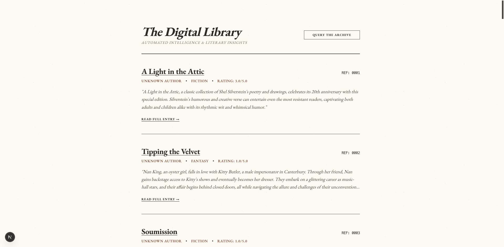
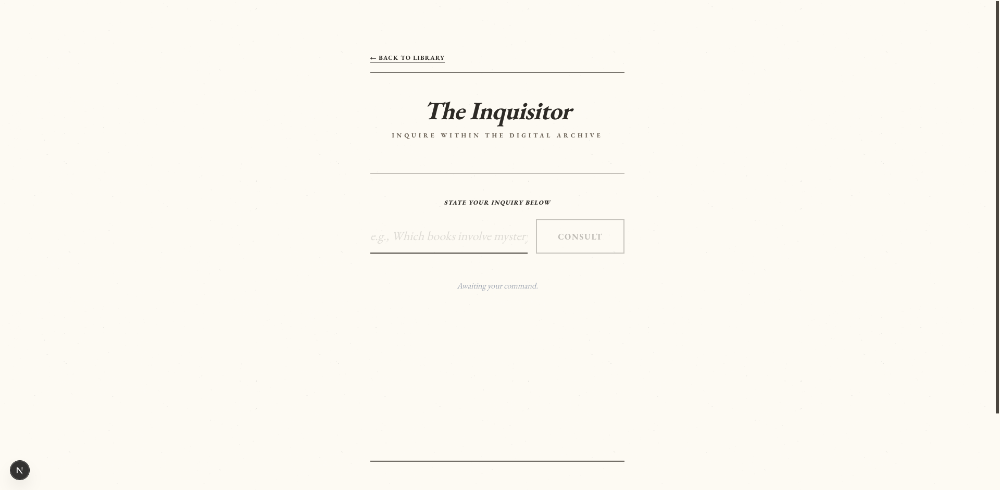
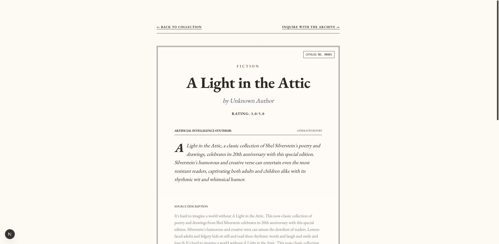

# Document Intelligence Platform 📚🧠

A full-stack, AI-powered digital archive that automates the collection of book data, generates intelligent literary insights, and provides an advanced Retrieval-Augmented Generation (RAG) interface for querying your library.

---

## 📸 Screenshots (Latest UI)

### Home Page - Library Archive



### The Inquisitor - RAG Q&A Interface



### Digital Manuscript - Book Detail



---

## ✨ Features

- **Automated Data Collection**: A scraper ingests book metadata from [books.toscrape.com](https://books.toscrape.com) and enriches it with AI-generated summaries, genres, and sentiment.
- **RAG Question Answering**: Ask natural-language questions across the entire corpus. Answers include source citations and persist between sessions.
- **Vector Recommendations**: "If you like X, you'll like Y" suggestions powered by embedding similarity.
- **Personal Archive**: Sign up / sign in, then bookmark, mark as reading, or finish books in your collection.

---

## 🚀 Interface Access

### 1. Library Archive (Home)

- **URL**: `http://localhost:3000`
- **Purpose**: View all collected books, their authors, genres, and AI-generated sentiment indicators.

### 2. Digital Manuscript (Book Detail)

- **Access**: Click on any book title in the Library Archive.
- **Features**:
  - **AI Synthesis**: A drop-cap summary generated by the LLM.
  - **Tone Analysis**: Sentiment classification of the book's description.
  - **Similar Books**: Vector-based recommendations ("If you like X, you'll like Y").
  - **Personal Archive**: Bookmark / reading / finished status (requires sign-in).

### 3. The Inquisitor (RAG Q&A)

- **Access**: Click **"Query the Archive"** from the Home page or **"Inquire with the Archive"** from any Detail page.
- **Features**:
  - **Intelligent Querying**: Ask natural language questions about the entire corpus.
  - **Source Citations**: Every answer includes links back to the source manuscripts.
  - **Session Persistence**: Your last query and its answer are saved automatically, so you can explore suggestions and return without losing your work.

---

## 🛠️ Tech Stack

- **Backend**: Django 5 / Django REST Framework, Python 3.11+
- **Database**: SQLite by default for dev (zero-config); MySQL supported via `DJANGO_DB_ENGINE`
- **Vector Store**: ChromaDB (persistent, `backend/chroma_db/`)
- **AI / LLM**: Groq API (default) with OpenAI API as automatic fallback
- **Embeddings**: Sentence Transformers (`all-MiniLM-L6-v2`)
- **Frontend**: Next.js 16, React 19, TypeScript, Tailwind CSS, EB Garamond typography
- **Scraper**: Python `requests` + BeautifulSoup

---

## ✅ Prerequisites

- **Python** 3.11 or newer
- **Node.js** 20+ and **npm** 10+
- A **Groq** or **OpenAI** API key (required for AI features and the scraper)
- _(Optional)_ A running **MySQL** server if you want to use MySQL instead of SQLite

---

## ⚡ Quick Start

```bash
# 1. One-time setup
python3 -m venv venv
source venv/bin/activate            # Windows: venv\Scripts\activate
pip install -r requirements.txt
cp .env.example .env                # set GROQ_API_KEY or OPENAI_API_KEY

cd frontend
cp .env.example .env.local
npm install
cd ..

# 2. Start everything (backend + frontend) with one command
./scripts/start.sh
# → Backend API:  http://127.0.0.1:8000/api/
# → Frontend UI:  http://localhost:3000
```

## 🚀 Startup & Deployment Commands

### Development

| Command                      | What it does                                                        |
| ---------------------------- | ------------------------------------------------------------------- |
| `./scripts/start.sh`         | Starts **both** servers — Django on `:8000` and Next.js on `:3000`. |
| `python manage.py runserver` | Backend only (from `backend/`, venv activated).                     |
| `npm run dev`                | Frontend only (from `frontend/`).                                   |
| `python scraper.py`          | Populate the archive (backend must be running).                     |

### Build & Deploy

| Command               | What it does                                                               |
| --------------------- | -------------------------------------------------------------------------- |
| `npm run build`       | Production build of the Next.js frontend (from `frontend/`).               |
| `./scripts/deploy.sh` | Migrate → collectstatic → build frontend → serve (uvicorn + `next start`). |

> `./scripts/deploy.sh` runs the backend with **uvicorn** (ASGI) and the frontend with
> `next start`. Override ports with env vars, e.g.
> `PORT=8000 NEXT_PORT=3000 ./scripts/deploy.sh`.

---

## 🚀 Setup & Installation (Dev Build)

> Run the backend and frontend in **two separate terminals** — or use `./scripts/start.sh` above to launch both at once. The backend must be running before the frontend can display data.

### 1. Clone & Configure Environment

```bash
git clone <your-repo-url>
cd Doc_Summariser

cp .env.example .env
# Edit .env — set at least one LLM API key (GROQ_API_KEY or OPENAI_API_KEY)
```

### 2. Backend Setup

```bash
# From the project root
python3 -m venv venv
source venv/bin/activate            # Windows: venv\Scripts\activate
pip install -r requirements.txt

cd backend
python manage.py migrate            # Applies existing migrations (SQLite by default)
python manage.py runserver 8000
# Backend API: http://127.0.0.1:8000/api/
```

> **Note**: Migrations are already committed (`backend/api/migrations/`). You do **not** need to run `makemigrations` for a fresh dev build.
>
> **MySQL (optional)**: Set `DJANGO_DB_ENGINE=django.db.backends.mysql` in `.env`, fill in the `DATABASE_*` values, create the database (`CREATE DATABASE document_intelligence;`), and run `python manage.py migrate`.

### 3. Frontend Setup

Open a **second terminal**:

```bash
cd frontend

cp .env.example .env.local          # Sets NEXT_PUBLIC_API_BASE_URL=http://127.0.0.1:8000/api
npm install
npm run dev
# Accessible at http://localhost:3000
```

> If your backend runs on a different host/port, update `NEXT_PUBLIC_API_BASE_URL` in `frontend/.env.local` accordingly.

### 4. (Optional) Data Collection

With the backend running and an LLM API key configured, populate the archive:

```bash
# From the project root, with the venv activated
python scraper.py
```

This scrapes 3 pages of books from books.toscrape.com, generates AI insights for each, and uploads them to the backend (`/api/books/upload/`). After it finishes, refresh the frontend to see the archive.

---

## 🔌 API Documentation

Base URL: `http://127.0.0.1:8000/api`

| Method | Endpoint                            | Description                                                     | Auth     |
| ------ | ----------------------------------- | --------------------------------------------------------------- | -------- |
| `GET`  | `/books/`                           | List all archived manuscripts.                                  | Public   |
| `GET`  | `/books/<id>/`                      | Retrieve full detail for a specific record.                     | Public\* |
| `GET`  | `/books/<id>/recommendations/`      | Get similarity-based recommendations.                           | Public   |
| `GET`  | `/books/surprise/`                  | Fetch a random book from the archive.                           | Public   |
| `POST` | `/books/upload/`                    | Scraper entry point for ingestion.                              | Public   |
| `POST` | `/qa/`                              | RAG query endpoint (`{"question": "..."}`).                     | Public   |
| `POST` | `/auth/register/`                   | Create an account (`{"username","password"}`) → JWT tokens.     | Public   |
| `POST` | `/auth/login/`                      | Sign in (`{"username","password"}`) → JWT tokens.               | Public   |
| `POST` | `/auth/refresh/`                    | Refresh an expired JWT access token.                            | Public   |
| `GET`  | `/books/archive/`                   | List the authenticated user's personal archive.                 | JWT      |
| `POST` | `/books/<id>/archive/`              | Set/update/remove status (`bookmarked`, `reading`, `finished`). | JWT      |
| `POST` | `/books/<id>/archive/` (empty body) | Remove the book from the user's archive.                        | JWT      |

_\* If authenticated, `/books/<id>/` also returns the current user's `user_status` for the book._

---

## ❓ Sample System Interactions

**Q: Can you find me a high-stakes mystery book?**

> **AI:** "The Girl on the Train" by Paula Hawkins is a compelling choice. It involves a commuter who becomes entangled in a missing persons investigation, leading to high-stakes psychological tension.
> _Source: The Girl on the Train (Ref: 1)_

**Q: What fantasy books are available in the archive?**

> **AI:** We currently have "Harry Potter and the Sorcerer's Stone" by J.K. Rowling. This is a fantasy novel about a young wizard's discovery of his magical heritage.
> _Source: Harry Potter and the Sorcerer's Stone (Ref: 4)_

**Q: Can you suggest a romance book with a strong female lead?**

> **AI:** "The Secret Garden" is a beautiful classic that explores deep emotional growth and the budding romance of nature and human connection through the eyes of Mary Lennox. For more contemporary options, our archive frequently updates with the latest romance titles.
> _Source: The Secret Garden (Ref: 12)_

---

## 🔧 Troubleshooting

| Issue                                                | Fix                                                                                                                                                                                         |
| ---------------------------------------------------- | ------------------------------------------------------------------------------------------------------------------------------------------------------------------------------------------- |
| Frontend shows "empty archive"                       | Ensure the backend is running on port `8000` and `NEXT_PUBLIC_API_BASE_URL` in `frontend/.env.local` points to `http://127.0.0.1:8000/api`. Restart `npm run dev` after changing env files. |
| `ModuleNotFoundError: No module named 'bs4'`         | Your venv predates the `beautifulsoup4` dependency — run `pip install -r requirements.txt` again.                                                                                           |
| AI answers fail / "Error: All LLM providers failed." | Check that `GROQ_API_KEY` (or `OPENAI_API_KEY`) is set in `.env` and restart the backend.                                                                                                   |
| Port 8000 already in use                             | Run the backend on another port: `python manage.py runserver 8001`, then update `NEXT_PUBLIC_API_BASE_URL`.                                                                                 |
| Vector store needs a reset                           | Stop the backend and delete `backend/chroma_db/`, then re-run the scraper.                                                                                                                  |

---

## 📁 Project Structure

```text
.
├── backend/                # Django app, API, ChromaDB integration
│   ├── api/                # Models, views, serializers, LLM utils, migrations
│   ├── backend/            # Django project settings & root URLs
│   └── chroma_db/          # Persistent ChromaDB vector store (gitignored)
├── frontend/               # Next.js app
│   └── src/app/            # Pages: Archive (home), Detail, Q&A, Personal Archive
├── scripts/
│   ├── start.sh            # Launch backend + frontend dev servers together
│   └── deploy.sh           # Production-style start (uvicorn + next start)
├── scraper.py              # Books.toscrape.com scraper (requests + BeautifulSoup)
├── requirements.txt        # Python dependencies
├── .env.example            # Backend configuration template
└── frontend/.env.example   # Frontend configuration template
```
